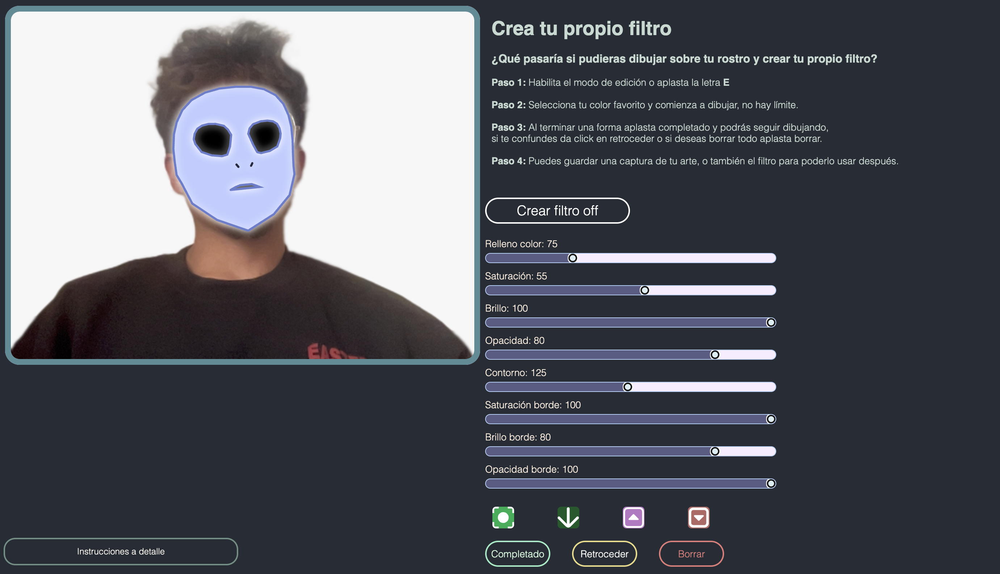
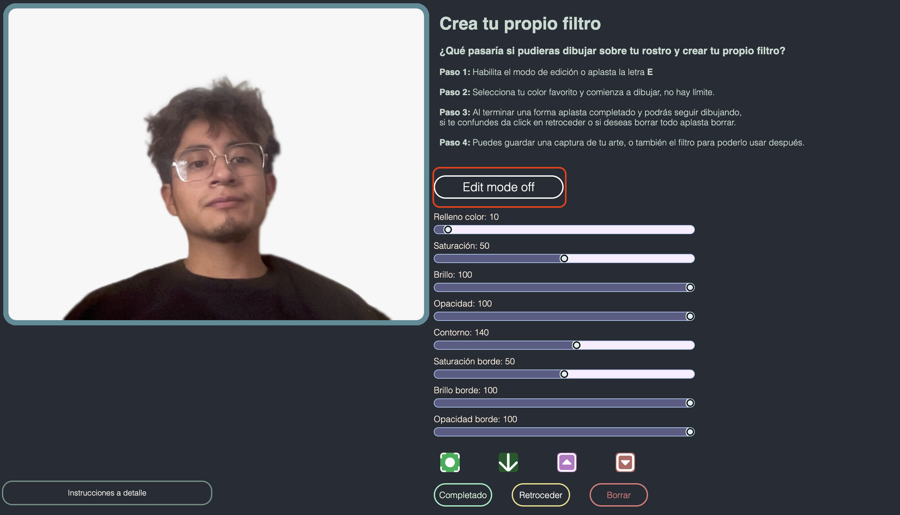
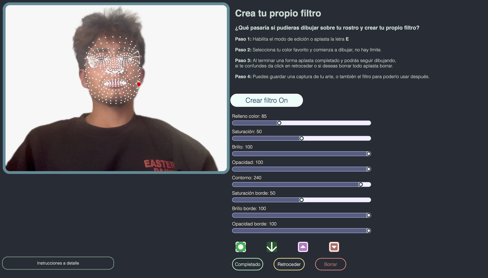
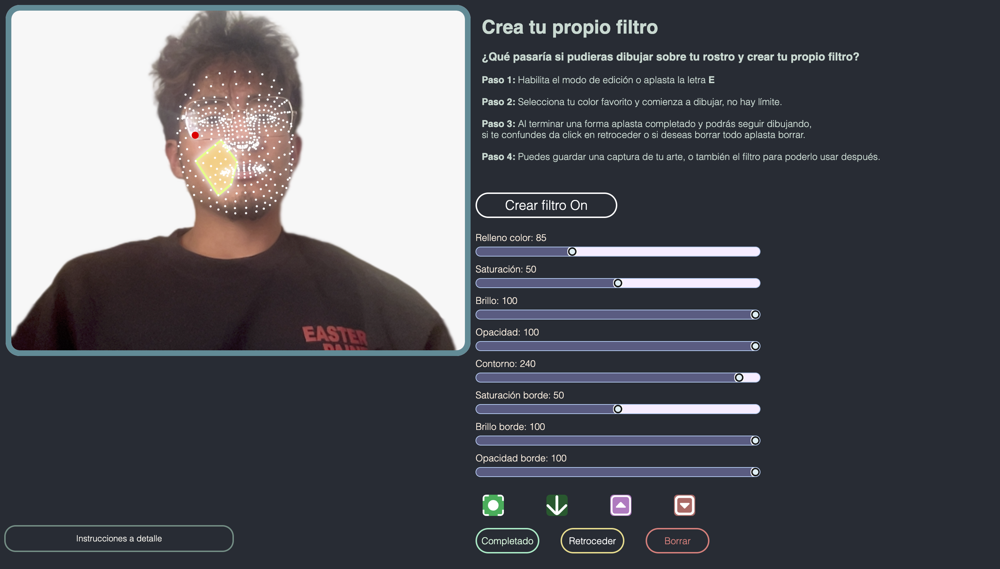
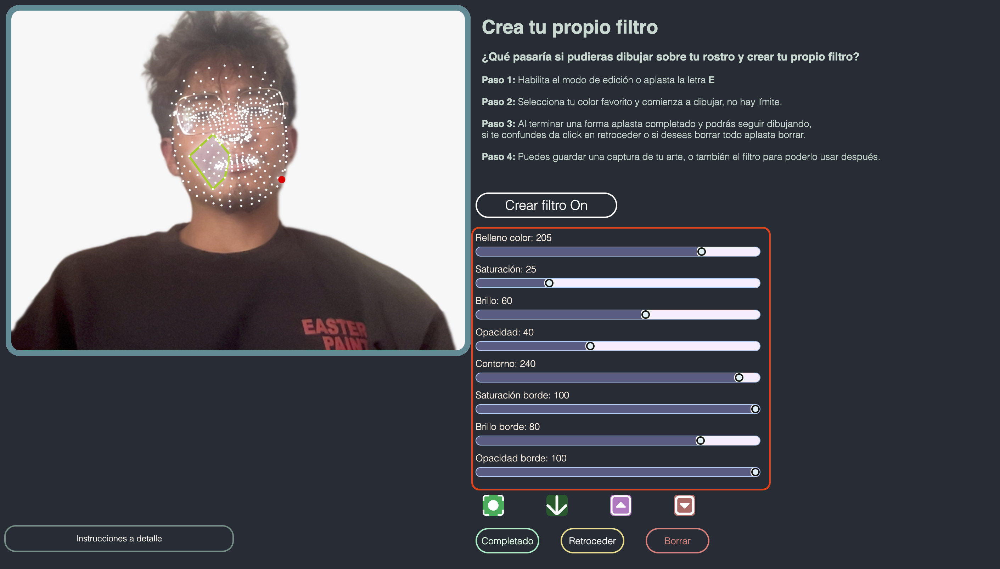
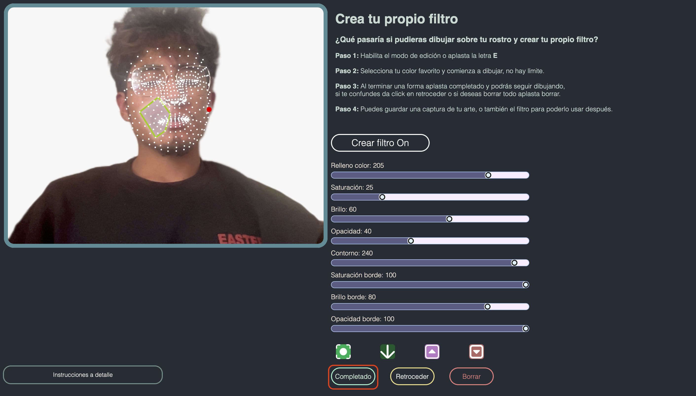
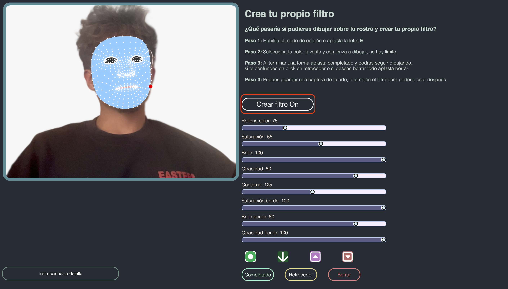
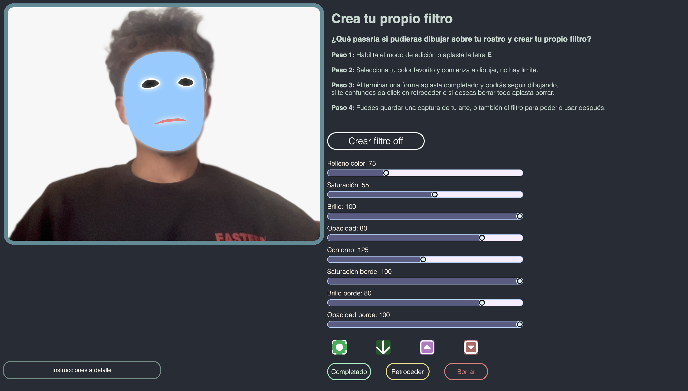
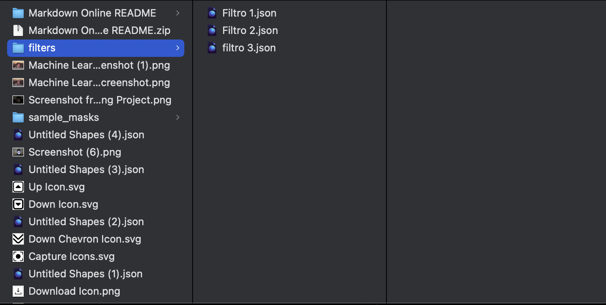

# **Face Moodifier: Una experiencia interactiva basada en detección facial**

# *Crea tu propio filtro*

¿Qué pasaría si pudieras dibujar sobre tu rostro y crear tu propio filtro?

## Pasos para crear tu propio filtro:

### Descarga filtros de ejemplo:

<a href="filters.zip" download>Click to Download</a> 

Arrastra el archivo .json a tu video y mira la magia.

- ## Paso 1:

Habilita el modo de edición o aplasta la letra E.

- ## Paso 1.1:

Aparecerán puntos en tu rostro, estos patrones te ayudarán a dibujar sobre él.

- ## Paso 2:

Selecciona tu color favorito y comienza a dibujar, no hay límite.

- ## Paso 3:

Puedes cambiar los colores de tu forma como más te guste.

- ## Paso 4:

Cuando termines de hacer una forma puedes darle a completado y podrás seguir dibujando más formas. Así mismo si te confundes de trazo puedes aplastar retroceder y si no te gusta tu filtro puedes borrar todo el contenido.

- ## Paso 5:

Sigue dibujando y llena tu rostro de figuras increíbles.

- ## Paso 6:

Para ver tu resultado sin los puntos de traqueo aplasta nuevamente en el botón de crear filtro para apagar el seguimiento facial.

- ## Paso 7:

Así podrás ver tu rostro con el filtro que has creado.

- ## Paso 8:

Pero ahí no queda todo, puedes hacer una captura de pantalla de tu filtro. Así mismo podrás guardar tu filtro para poder usarlo después, para ello da en la flecha de descarga junto a la de screenshot y se te descargará tu archivo .json con la información de tu filtro. Así mismo los botones de arriba y abajo te sirven para poder cambiar entre formas y editar sus colores o borrarlas.

- ## Paso 9:

Puedes guardar cuantos filtros desees, y para aplicarlos solo necesitas arrarchar el archivo .json a tu canvas o video.

### Recursos

- [ml5.js](https://ml5js.org/)

- [Face Mesh Detection](https://google.github.io/mediapipe/solutions/face_mesh.html)

- [Repositorio del Proyecto](https://github.com/mattewrobles/machine_learning_project)
